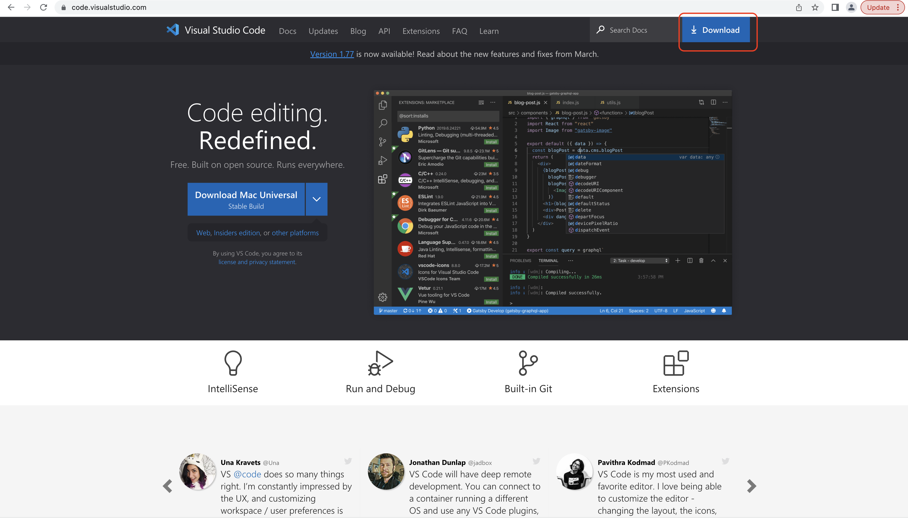
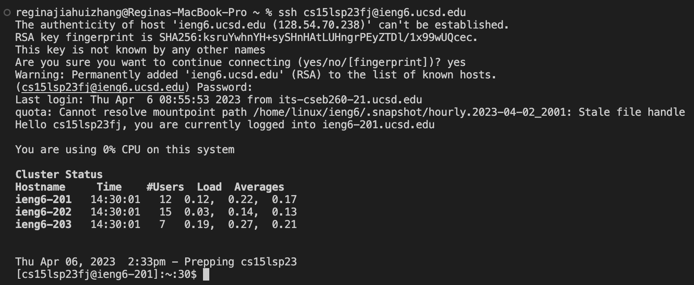
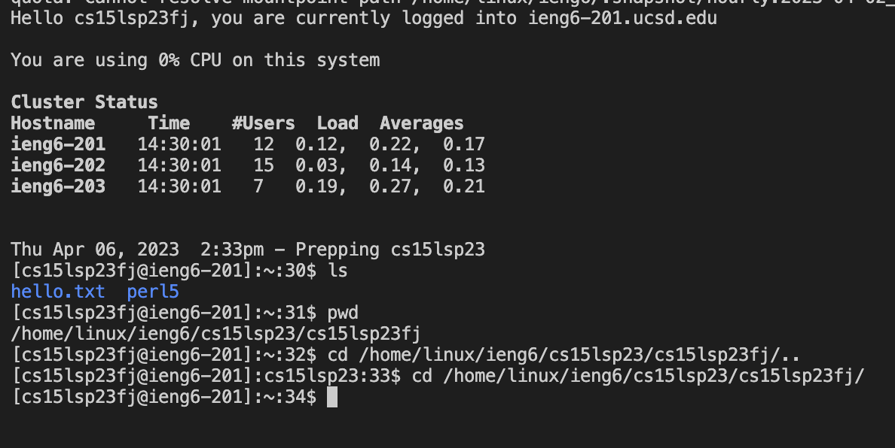

# LAB REPORT 1
this page will describe how to log into a course-specific account on ieng6 for CSE 15L

## Installing VScode
  First install java onto your computer if it is not installed yet. 
    Click on this [Link](https://www.oracle.com/java/technologies/downloads/#jdk18-mac) to redirect to java downloard website
  Then go to VScode's [Link](https://code.visualstudio.com/) to downloard the application.
  Click download on the blue download button on the top right corner of the webpage
  

 ## Remotely Connecting
  Once installed Java and VSCode on your computer you are all set to get connected the remote
  servers
  1. open a terminal in VSCode (Control or Command(depending on which operating system you arte using) or use the new terminal menu option)
  2. type in `ssh cs15lsp23zz@ieng6.ucsd.edu` (replace `zz` with the letters by the letters in your course specific account)
  3. then type in your password to connect to the remote server 
  4. if it is your first time connecting to the server thers' going to be the following code occuring on your sceen. If it is you operating type in `yes` and press enter
  ```
  The authenticity of host 'ieng6.ucsd.edu (128.54.70.238)' can't be established.
  RSA key fingerprint is SHA256:ksruYwhnYH+sySHnHAtLUHngrPEyZTDl/1x99wUQcec.
  This key is not known by any other names
  Are you sure you want to continue connecting (yes/no/[fingerprint])?
  ```
  5. after you press enter, retype your password and return enter again
  6. Connected!
  
## Try Some Commands
  You could try out the following commands
  1. `cd ~`
      This command typically is used in the command line to change the current working directory
  3. `ls`
      This command is typically used in the command line to list the files and directories in the current working directory
  5. `ls <directory>`
      `ls<directory>` is similar to ls, which also shows the files in the current working directory in the command line. But differnt from `ls`,            `ls<directory>` can be used to list the files of another directory other than than the one you are currently working on.
  7. `mkdir`
      This command typically is used in the command line to create a new directory
  8. `pwd`
      This command writes to standard output the full path name of your current directory.
  9. `..`
      `..` is a relative path operator that allows you to navigate to the parent directory or your current working directory 
  10. `exit` (to log out the remote serve or you could use Command/Ctrl-D)
      `exit` allows you to log out the remote serve in the command line.
  

