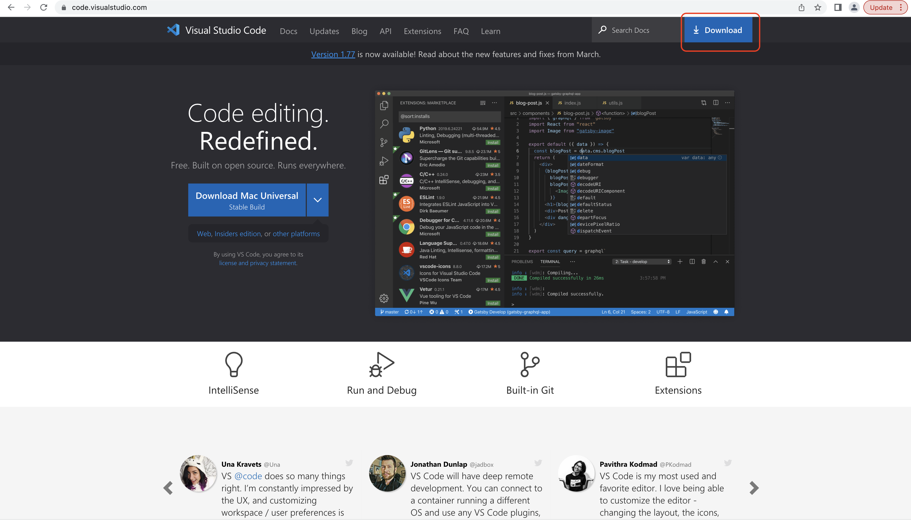

# LAB REPORT 1
this page will describe how to log into a course-specific account on ieng6 for CSE 15L
## Installing VScode
  First install java onto your computer if it is not installed yet. 
    Click on this [Link](https://www.oracle.com/java/technologies/downloads/#jdk18-mac) to redirect to java downloard website
  Then go to VScode's [Link](https://code.visualstudio.com/) to downloard the application.
  Click download on the blue download button on the top right corner of the webpage
  
//should include all steps you took along with screenshots of what eachstep look like
//have at least 3 screenshots, one for each of the steps below
// for each step write at least 2-3 sentences of bullet point desciring what you did
1. installing VScode
2. Remotelt Connecting
3. Try Some Commands
4.

You will upload your submission by publishing the page on Github Pages, then printing the page to PDF and uploading to the Lab Report 1 assignment on Gradescope.

