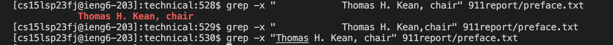
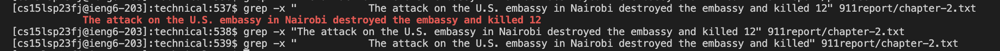

# Researching Commands


## Interesting command-line options

```
1. `-o`
2. `-v`
3. `-L`
4. `-i`
```

## Example for Four Interesting command-line options - `-x`
Example 1: 

Example 2:

## Example for Four Interesting command-line options - `-v`
Example 1:
Example 2:
## Example for Four Interesting command-line options - `-w`
Example 1:
Example 2:
## Example for Four Interesting command-line options - `-i`
Example 1:

Example 2:

