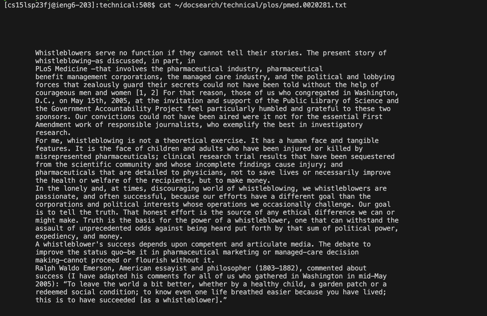
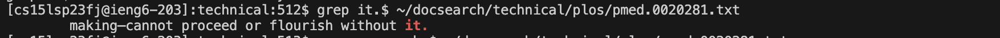
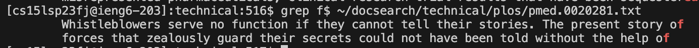
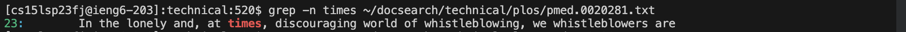
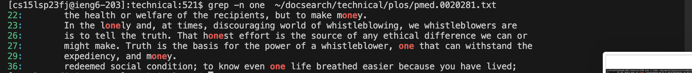
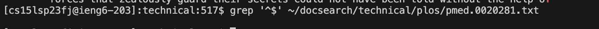
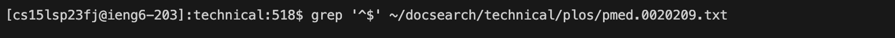
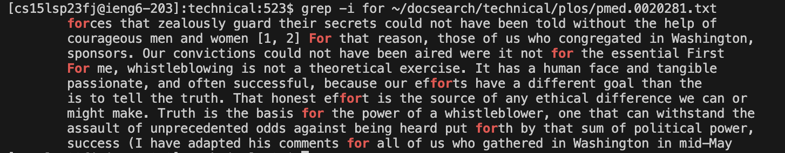
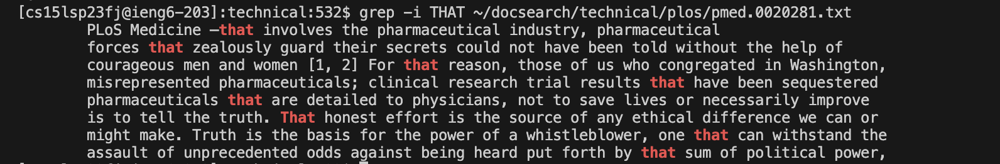

# Researching Commands


## Interesting command-line options

```
1. `grep []$`
2. `grep -n`
3. `grep '^$'`
4. `grep -i`
```
* the four command-line option will all opearte on the text file below (except for one example for `grep '^$'`): 





with the directory :


/home/linux/ieng6/cs15lsp23/cs15lsp23fj/docsearch/technical/plos/pmed.0020281.txt


## Example for Four Interesting command-line options - `grep []$`


Bash shell treats dollar symbol ‘$’ as a special character which marks the ends of line or word. List all the lines of /etc/passwd that ends with “bash” word.


* I found this operation on https://www.linuxtechi.com/grep-command-examples-in-linux/


Example 1: 





Example 2:





## Example for Four Interesting command-line options - `grep -n`
Use ‘-n’ option in grep command to display line and its number which matches the pattern or word.
* I found this operation on https://www.linuxtechi.com/grep-command-examples-in-linux/


Example 1: 





Example 2:




## Example for Four Interesting command-line options - `grep '^$'`
Grep command can also print all the empty or blank lines from a file use the special character combination ‘^$’ , example is shown below:
* I found this operation on https://www.linuxtechi.com/grep-command-examples-in-linux/


Example 1: 





Example 2:




## Example for Four Interesting command-line options - `grep -i`
Grep command can also print the characters ignoring case sensitivity. 
* I found this operation on https://www.digitalocean.com/community/tutorials/grep-command-in-linux-unix#ignoring-case-sensitivity


Example 1: 





Example 2:



