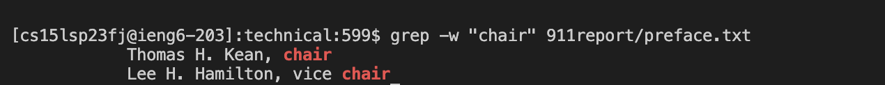
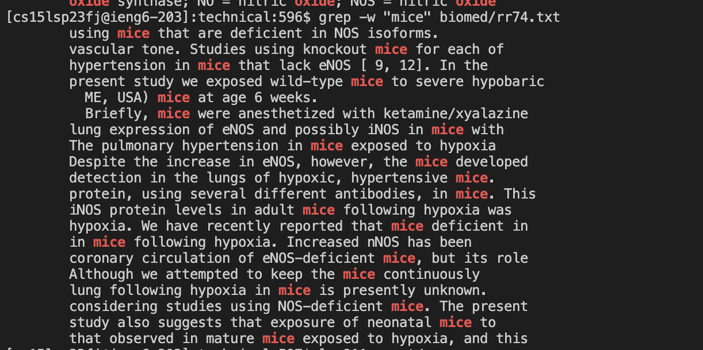
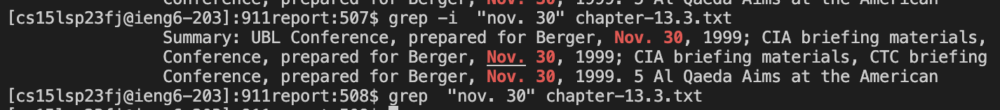
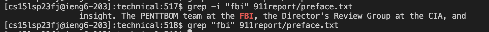

# Researching Commands


## Interesting command-line options

```
1. `-x`
2. `-n`
3. `-w`
4. `-i`
```

## Example for Four Interesting command-line options - `grep []$`
Bash shell treats dollar symbol ‘$’ as a special character which marks the ends of line or word. List all the lines of /etc/passwd that ends with “bash” word.
* I found this operation on https://www.linuxtechi.com/grep-command-examples-in-linux/
## Example for Four Interesting command-line options - `grep -n`
Use ‘-n’ option in grep command to display line and its number which matches the pattern or word.
* I found this operation on https://www.linuxtechi.com/grep-command-examples-in-linux/


## Example for Four Interesting command-line options - `-w`
Example 1:

Example 2:

## Example for Four Interesting command-line options - `-i`
Example 1:

Example 2:

