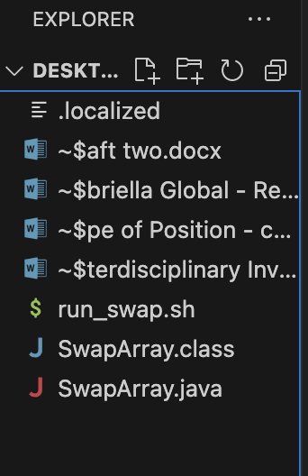
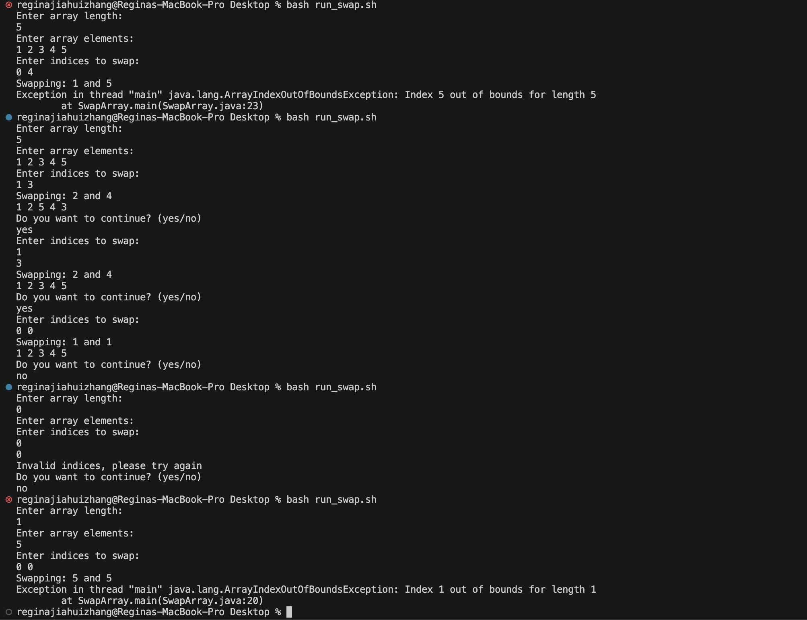
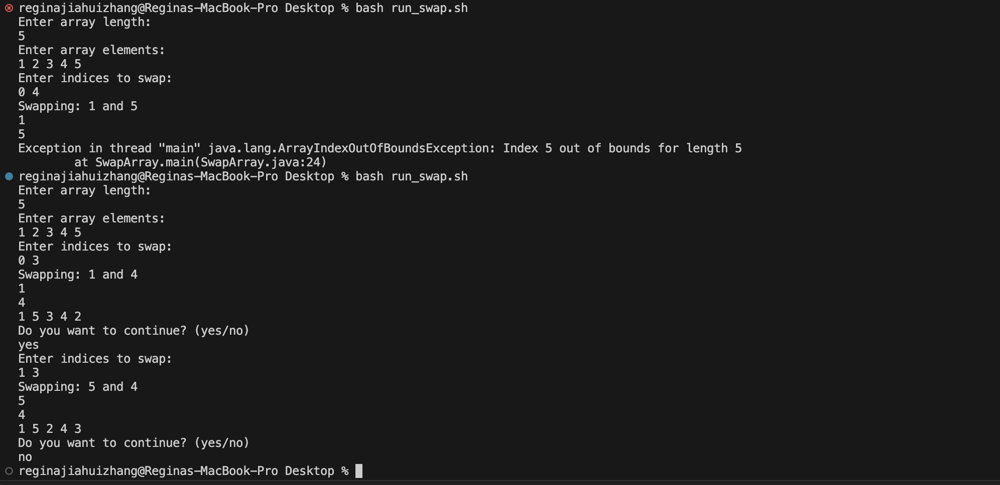

# Lab Report 5

## Part 1 - Debugging Scenario

**Original Post** :

This portion of the lab report would show a debugging scenario. 

*Description of the issue* : 

This probject has the following file layout: 



and the run_swap.sh contains the following code: 

```
javac SwapArray.java
java SwapArray
```

In the environment I am using, MAC OS on visual studio code, I am having some trouble with my Java script that is supposed to manipulate the array by swapping elements based on user inputs. However, I am getting an unexpected output. Here's what I am seeing. 



I was expecting what I input into the indices to swap wouldn't result in index out of bound for 4. Also for the second try, I was expected to swap 1 3 instead of 2 and 4. Moreover, when the length of the array is equal to 1, I am expecting to see the original array. 

**TA Response**: 

The issue seems to lie within teh block of code that is responsible for the swapping operation. Could you try printing the array elements before and after the swap operation and also the values of the indices? this could help you narrow down where exactly the error is occuring. 

**New Terminal Output after Student's Debugging**: 



The bug is caused by the code 'array[a+1]' and 'array[b+1]' in the swapping operation. Instead of swapping the elements at indeices a and b, the program is attempting to swap the elements at the indices a+1 and b+1. 

**All information needed about the setup**: 

1.    *the file and directory sturcutre*


   | - Desktop


         | - run_swap.sh
       
      
         | - SwapArray.java
       
2. 
  
  
  *the contents of run_swap.sh*

```
javac SwapArray.java
java SwapArray
```

   *the contents of SwapArray.java*

```
import java.util.Scanner;

public class SwapArray {
    public static void main(String[] args) {
        Scanner input = new Scanner(System.in);
        System.out.println("Enter array length: ");
        int len = input.nextInt();
        int[] array = new int[len];
        System.out.println("Enter array elements: ");
        for (int i = 0; i < len; i++) {
            array[i] = input.nextInt();
        }
        while (true) {
            System.out.println("Enter indices to swap: ");
            int a = input.nextInt();
            int b = input.nextInt();
            if (a < len && b < len) {
                System.out.println("Swapping: " + array[a] + " and " + array[b]);
                //int temp = array[a];
                int temp = array[a+1];
                // array[a] = array[b];
                // array[b] = temp;
                System.out.println( array[a] + "\n" +array[b]);
                array[a+1] = array[b+1];
                array[b+1] = temp;
                for (int i : array) {
                    System.out.print(i + " ");
                }
                System.out.println();
            } else {
                System.out.println("Invalid indices, please try again");
            }

            System.out.println("Do you want to continue? (yes/no)");
            String response = input.next();
            if (response.equalsIgnoreCase("no")) {
                break;
            }
        }
    }
}
```

*the full command line I ran to trigger the bug*: 

```
chmod +x run_swap.sh
./run_swap.sh
```

**A description of what to edit to edit to fix the bug**:

In the swapping operation, replace the array[a+1] and array[b+1] with array[a] and array[b] respectively. This will ensure that the correct indices are being swapped. 

## Part 2 - Reflection

During this quarter, I learnt a great deal about debugging and tracing errors. Previously, I would just scan through the code and try to identify the issues visually. However, this lab has taught me to appraoch debuggingn systematically, by running tests, inspecting varaibles and using print statements to track the flow and state of the program. This made me realize how important a logical and methodical appraoch is in resolving issues in code. This skill will definitely prove to be invaluable in my future coding endeavors. 
