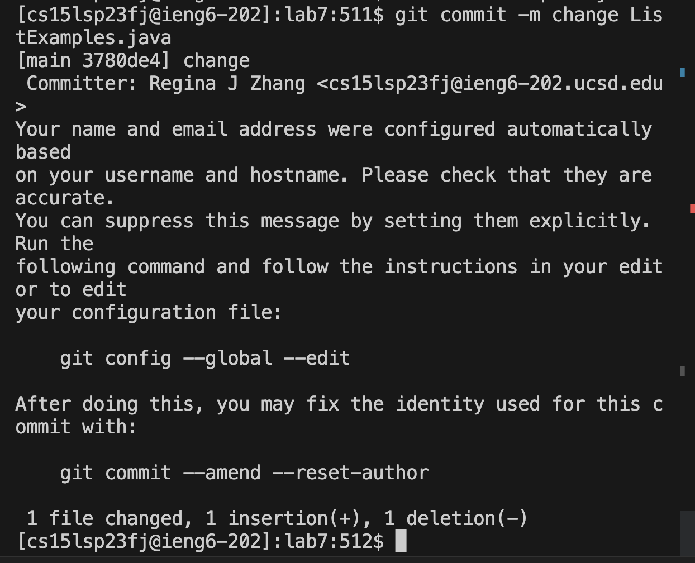

# Lab Report 4: Performing Tasks

## Log into ieng6 

`ssh cs15lsp23fj@ieng6.ucsd.edu`
`<Enter>`
Since we generated SSH Keys for ieng6 I don't have to retype the password for ieng6. after typing in the ssh and the account name + <enter> will log me back into the course account.
 
  
## Clone fork of the repository from Github account
  

  
`ls`
  
  
`git clone git@github.com:ReginaJhz/lab7.git`

  
`ls`

  
`<Enter>` 

  
before cloneing the repository make sure the folder does not contain any directories with the same name as the repository we are cloning. 

  
Then use `git clone` + `git@github.com:ReginaJhz/lab7.git`, which is the ssh link for the repository + `<enter>` to clone the repository. 

  
Then use ls to check the repository is successfully cloned. 

## Run the tests, demonstrating that they fail
  
  
  

  
  `cd lab7` `ls` `javac ListExamplesTests.java` `Enter`
 
  First cd into the directory we are working on, then use `ls` to double check the files in lab7 folder. 
  
  
  Then use `javac ListExamplesTests.java` to compile the ListExamplesTests.java, which turns out to fail. 
  
## Edit the code file to fix the failing test
 
`vim ListExamples.java` `<Enter>` `j j j j h h h h h h x i 2 <ESC> : wq <Enter>`
 
open the buggy file ListExamples.java with vim, using `vim <filename>`. 
 
 Then use <h><j><j><l> to move the cursor around with <j> moving the cursor down, <k> moving the cursor up, <h> moving the cursor forward, <l> moving the cursor backwards. WHen moved to `index1`'s `1` press x to remove it, then use `i` to get in the insert mode and then press `2` ro insert the 2 to complete coorect variable name. After chagnes are made, press `:wq` `<enter>` to save the changes and exist vim.
 
 
 ## Running the tests, demonstrating that they now succeed 
 
 
 
 
 `javac -cp .:lib/hamcrest-core-1.3.jar:lib/junit-4.13.2.jar ListExamplesTests.java ListExamples.java` `<enter>` `java -cp .:lib/hamcrest-core-1.3.jar:lib/junit-4.13.2.jar org.junit.runner.JUnitCore ListExamplesTests` `<enter>`
 
 
 Recompile the file ListExamplesTests.java using  `javac -cp .:lib/hamcrest-core-1.3.jar:lib/junit-4.13.2.jar ListExamplesTests.java ListExamples.java` then run the junit tests by using  `java -cp .:lib/hamcrest-core-1.3.jar:lib/junit-4.13.2.jar org.junit.runner.JUnitCore ListExamplesTests`.
 
 
 ## Commit and push the resulting change to your Github account 
 
 
 
 
 
 
 
 `git commit -m "change ListExamples.java"` `<enter>`
 
 `git push -u origin main `
 
 
The `git commit` command is used to save changes to the local Git repository. The `-m` flag is followed by a commit message in quotes `""`, which describes the changes made in the commit. This command creates a new commit with the changes and associates the commit message with it.

The `git push` command is used to upload local commits to a remote repository, in this case my github repository. The `-u` flag sets up tracking between the local branch and the remote branch. It enables the use of the shorthand command git push for future pushes. origin refers to the name of the remote repository where you want to push your changes. main represents the branch name. In this case, it's assuming the main branch as the target for pushing the changes. When running this command, Git pushes the local commits to the specified remote repository and branch.
